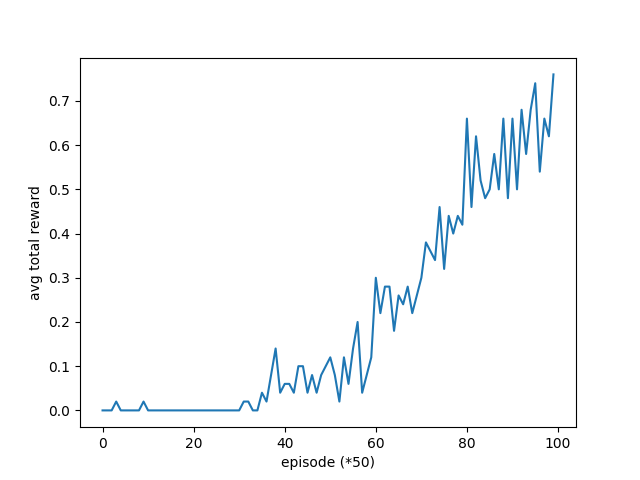
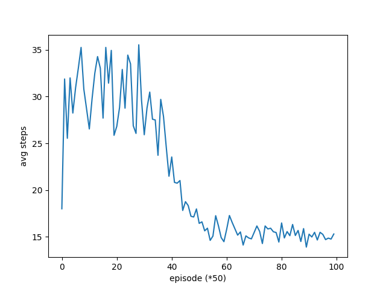
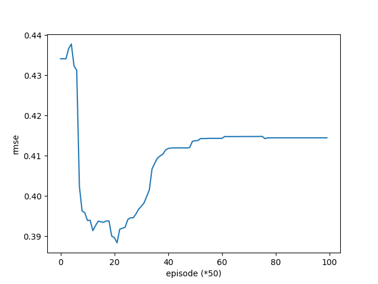

Sanket Shah

ss4228

# Assignment 4

The policy iteration approach essentially presume kledge of the probability parameters of the environment, whereas the q-learning assumes we don’t k it, and adds noise to the policy decisions to find the optimal policy semi-stochastically. The policy iteration approach was simple, dividing the process into 2 parts: iteration and evaluation. These functions were written separately.  Dynamic programming was not used The final policy array table is in the Q.npy file in the code. The path taken by the agent (defined by policy) is such: 

 in state: 0
move: Right
 in state: 1
move: Right
 in state: 2
move: Right
 in state: 3
move: Right
 in state: 4
move: Right
 in state: 5
move: Right
 in state: 6
move: Right
 in state: 7
move: Down
 in state: 15
move: Down
 in state: 23
move: Down
 in state: 31
move: Down
 in state: 39
move: Down
 in state: 47
move: Down
 in state: 55
move: Down
final state: 55
Done: True

Over 5000 episodes, the average reward was .822

The Q learning function ignores the .P property of the environment and stochastically maps actions to state changes. Across 5000 episodes, it reached an aggregated average (the last 50 episodes.) of .76. So it definitely underperformed the policy iteration model, though conceivably could equal the performance of the policy iteration. Hyperparameters were tricky to tune. The adjustment with the biggest impact was cranking the epsilon threshold up to 2 and then swiftly decaying it down. Essentially, this keeps it elevated for longer, and then very quickly diminishes, rather than a smooth geometric curve. Below are the plots for average number of steps taken and average total reward, as well as RMSE. Strangely, the RMSE didn’t improve much, it dropped to .39 before leveling off around .42, which is pretty significant. Problem 3 was not completed….

